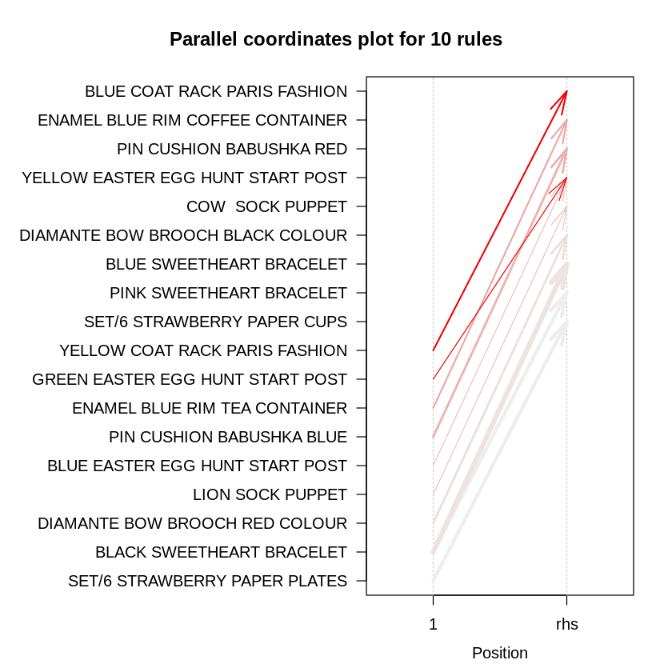

# Project Machine Learning for Retail with R: Product Packaging
## Deskripsi
Produk-produk yang memiliki stok berlebih dapat menjadi masalah. Salah satu solusinya adalah membuat paket yang inovatif. Dimana produk yang sebelumnya tidak terlalu laku tapi punya pangsa pasar malah bisa dipaketkan dan laku.
Dengan skrip R ini, kita dapat mengetahui:
1. 10 produk dengan transaksi tertinggi
2. 10 produk dengan transaksi terendah
3. 10 paket kombinasi produk yang paling "menarik"
4. Paket produk yang bisa dipasangkan dengan item Slow-Moving

## Penggunaan
1. Clone repo ini atau download file .zip nya (kemudian extract jika download .zip nya).
2. Buka program R kemudian ketik di console: `setwd("jalur/ke/folder/proyek")`. Sebagai contoh, kalau di extract di folder D:/Documents maka ketik: `setwd("D:/Documents/product-packaging")`.
3. Siapkan dataset
    * Unduh dataset [Online Retail II Data Set from ML Repository](https://www.kaggle.com/mathchi/online-retail-ii-data-set-from-ml-repository) di Kaggle
    * Buat folder `Dataset` di dalam folder proyek (product-packaging), dan pindah dataset yang diunduh tadi ke sini.
4. Jalankan script
    * Jalankan script *pre_processing.R* terlebih dahulu untuk mempersiapkan data. Pada line
        ```R
        # baca file excel ke data frame
        retail <- read_excel("Dataset/online_retail_II.xlsx", "Year 2009-2010")
        ```
        argumen kedua dari fungsi `read_excel()` menunjukkan sheet pada dataset. Ganti `"Year 2009-2010"` dengan `"Year 2010-2011"` jika ingin menggunakan data tahun 2010-2011.
    * Script itu akan menghasilkan dataset baru dengan nama *market_basket_transaction.csv* di folder *Dataset*
    * Setelah itu bebas jalankan script manapun (tidak harus berurut), dan file hasilnya akan muncul di folder Output sesuai dengan nama scriptnya (khusus script *kombinasi_retail_slow_moving.R* akan menghasilkan gambar).

## Analisis
---
### Statistik Top 10 & Bottom 10
Dengan hasil ini kita dapat mengetahui item mana dengan transaksi tertinggi dan terendah.

Dari hasil yang didapat, 3 dari 10 item dengan transaksi teratas adalah
1. WHITE HANGING HEART T-LIGHT HOLDER
2. REGENCY CAKESTAND 3 TIER
3. STRAWBERRY CERAMIC TRINKET BOX

Sedangkan item dengan transaksi paling sedikit, 3 diantaranya adalah
1. 10 COLOURS - SPACEBOY
2. 11 PC CERAMIC TEA SET POLKADOT
3. 2 DAISIES HAIR COMB
---
### Mendapatkan Kombinasi Produk yang Menarik
Kombinasi menarik yang dimaksud adalah yang memenuhi kriteria berikut.
- Memiliki asosiasi atau hubungan erat.
- Kombinasi produk minimal 2 item, dan maksimum 3 item.
- Kombinasi produk itu muncul setidaknya 10 dari dari seluruh transaksi.
- Memiliki tingkat confidence minimal 50 persen.

Sebagai contoh, dari output yang didapat,
- 100% customer yang membeli YELLOW COAT RACK PARIS FASHION juga membeli BLUE COAT RACK PARIS FASHION.
- 100% customer yang membeli GREEN EASTER EGG HUNT START POST juga membeli YELLOW EASTER EGG HUNT START POST

Berikut adalah visualisasi dalam bentuk koordinat paralel (paracoord) dari kombinasi yang didapat.



Jika dilihat pada panah paling atas, ini berarti jika customer membeli YELLOW COAT RACK PARIS FASHION pasti akan juga membeli BLUE COAT RACK PARIS FASHION.

---
### Mencari Paket Produk yang bisa dipasangkan dengan Item Slow-Moving
Slow-moving item adalah produk yang pergerakan penjualannya lambat. Ini bisa menjadi masalah jika produk masih menumpuk.

Item ini belum tentu tidak laku, mungkin hanya tidak cocok jika dijual satuan atau memang harganya yang tidak cocok. Maka dari itu perlu dicari asosiasi yang kuat dari item produk ini dengan produk lain sehingga jika dipaketkan akan lebih menarik.

Anggaplah produk tersebut adalah 3D TRADITIONAL CHRISTMAS STICKERS dan HEART T-LIGHT HOLDER. Dan masing-masing item ingin dicari 3 paket yang paling kuat asosiasinya. Maka hasil yang didapat adalah, sebagai contoh,
- 3D TRADITIONAL CHRISTMAS STICKERS akan cocok jika dipaketkan dengan 3D CHRISTMAS STAMPS STICKERS dan 3D VINTAGE CHRISTMAS STICKERS
- HEART T-LIGHT HOLDER cocok jika dipaketkan dengan CHRISTMAS TREE T-LIGHT HOLDER dan STAR  T-LIGHT HOLDER.

---
### Referensi
- [DQLab](www.dqlab.id) - Project Machine Learning for Retail with R: Product Packaging. Data Mentor oleh Xeratic
- [Datacamp - Market Basket Analysis using R](https://www.datacamp.com/community/tutorials/market-basket-analysis-r)